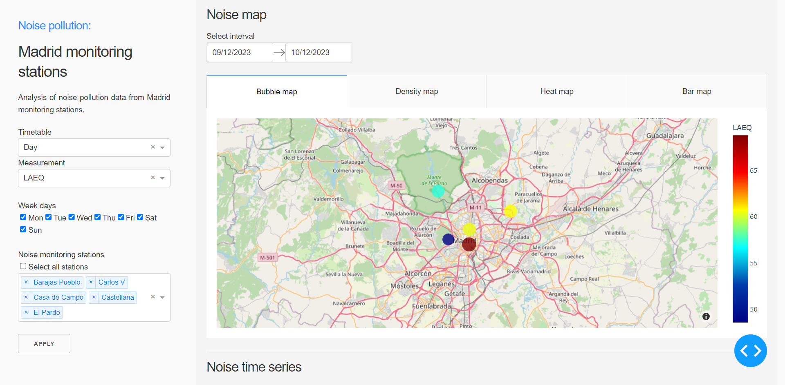

# madrid-noise-pollution

## About this app

This dashboard allows you to explore Madrid noise pollution throughout the noise data provided by the monitoring stations daily.
 
## Requirements

* Python 3

## How to run this app

We suggest you to create a virtual environment for running this app with Python 3. Clone this repository 
and open your terminal/command prompt in the root folder.

```
git clone alejandromoreno/noise-pollution-analysis/madrid-noise-pollution
cd madrid-noise-pollution
python3 -m virtualenv venv

```
In Unix system:
```
source venv/bin/activate

```
In Windows: 

```
venv\Scripts\activate
```

Install all required packages by running:
```
pip install -r requirements.txt
```

Run this app locally with:
```
python app.py
```

## Screenshot



## Resources

* [Dash](https://dash.plot.ly/)

